```{r setup, include=FALSE}
knitr::opts_chunk$set(
  echo = TRUE, eval = FALSE, collapse = TRUE, comment = "#>",
  fig.align = "center", out.width = "100%"
)
```

# Introduction

Differential expression (DE) analysis is a core step in RNA-Seq and other
high-throughput studies: given counts for two or more groups of samples, which
genes or regions change more than expected by chance? **DEBrowser** turns that
analysis into an interactive, point-and-click experience. It wraps three
established Bioconductor engines —
[DESeq2](https://bioconductor.org/packages/DESeq2) (Love et al., 2014),
[edgeR](https://bioconductor.org/packages/edgeR) (Robinson et al., 2010), and
[limma](https://bioconductor.org/packages/limma) (Ritchie et al., 2015) — in a
[Shiny](https://shiny.posit.co) application so that changing a cutoff, a
normalization method, or a comparison re-draws every plot and table in real
time.

Beyond the DE test itself, DEBrowser bundles quality-control views (PCA,
sample-to-sample correlation, IQR, density), batch-effect correction,
interactive scatter/volcano/MA plots with linked heatmaps, GO/KEGG and GSEA
enrichment, cross-contrast concordance, exportable result tables, and an
optional AI interpretation assistant — all without writing code.

```{r hero, echo=FALSE, eval=TRUE, fig.cap="DEBrowser opens on the Data Prep wizard. A guided six-step pipeline runs down the left rail; the workspace fills the rest."}
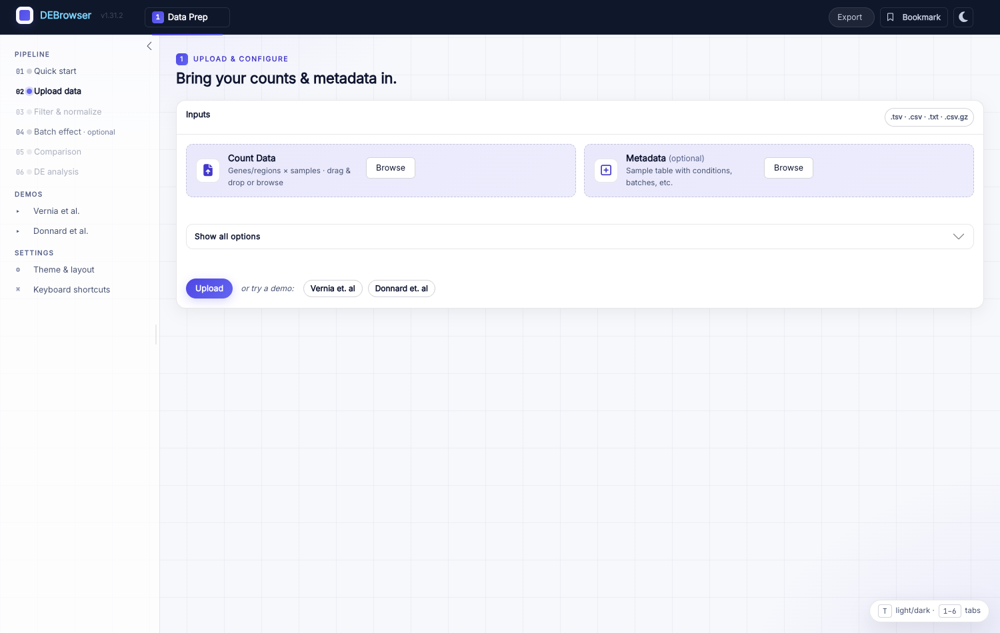
```

## What's new in the modern interface

The interface has been rebuilt on
[bslib](https://rstudio.github.io/bslib/) with a clean, restrained design
("Clinical Indigo"):

- A **six-step Data Prep wizard** (Quick start → Upload → Filter & normalize →
  Batch effect → Comparison → DE analysis) replaces the old free-form sidebar,
  so the path from counts to results is explicit and each step unlocks the
  next.
- **Six top-level tabs** — Data Prep, Main Plots, QC Plots, Concordance,
  Enrichment, Tables — reachable with the number keys `1`–`6`.
- A **light / dark theme** toggle (the moon/sun button, or the `T` key).
- **Bookmark & share** of the full analysis state, **reproducibility exports**
  (R script, R Markdown, Jupyter notebook, methods paragraph), and an optional
  **AI interpretation** panel on the Enrichment tab.

```{r dark, echo=FALSE, eval=TRUE, fig.cap="The same screen in dark mode. Press T (or click the moon) to toggle; the choice persists across the session."}
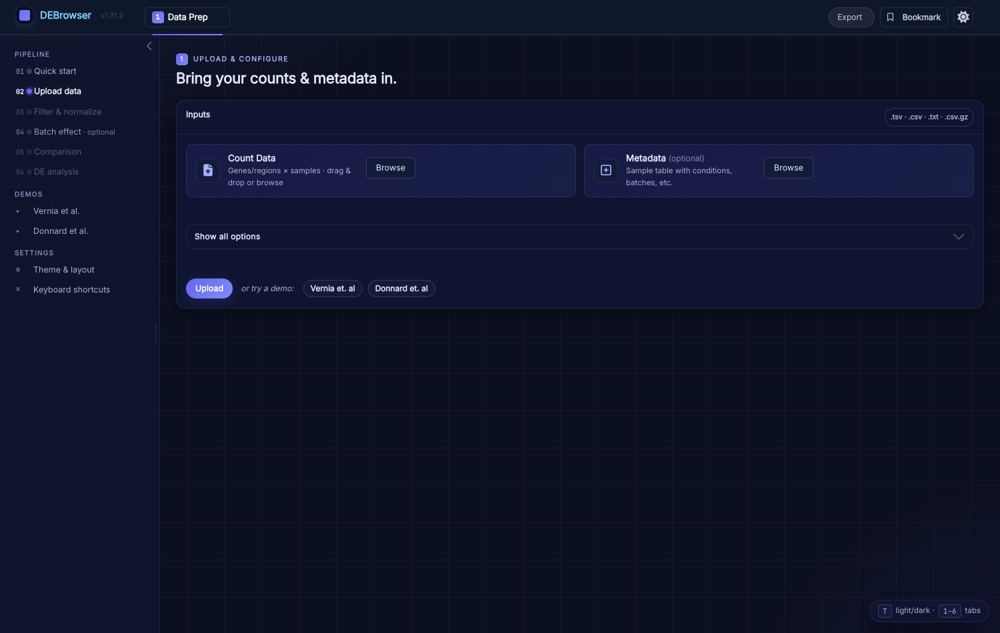
```

# Quick start

You need R (and, optionally, RStudio). Install DEBrowser from Bioconductor and
launch it:

```{r install}
# 1. Install DEBrowser and its dependencies
if (!requireNamespace("BiocManager", quietly = TRUE))
    install.packages("BiocManager")
BiocManager::install("debrowser")

# 2. Load the library
library(debrowser)

# 3. Start DEBrowser
startDEBrowser()
```

`startDEBrowser()` opens the app in your browser on a fixed port (`3838` by
default, so bookmark URLs stay stable across restarts). If your operating
system is missing system libraries, see *Operating System Dependencies* below.

The fastest way to see DEBrowser in action is the **Quick Start** step: it
explains what each stage does and lets you load a bundled demo (Vernia et al.,
2014) with one click, so you can walk the whole pipeline before bringing your
own data.

```{r quickstart, echo=FALSE, eval=TRUE, fig.cap="The Quick Start guide: an in-app tour of the workflow, with one-click demo data."}
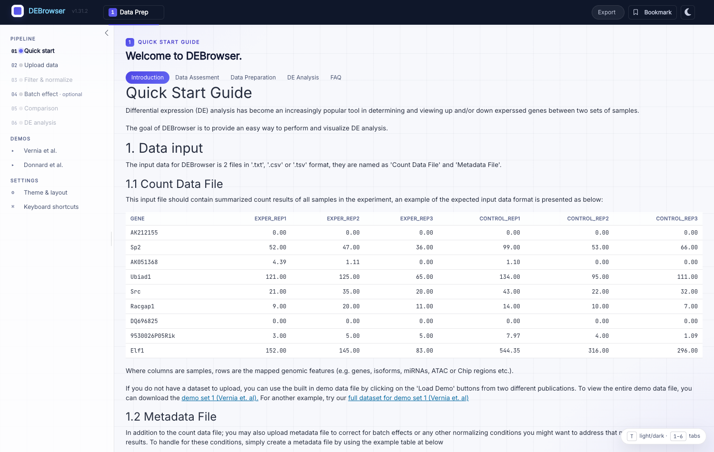
```

# The Data Prep pipeline

All data loading and preparation happens on the **Data Prep** tab, organized as
a wizard down the left rail. Steps light up as their prerequisites are met; a
progress pill on each step shows *pending → done*.

## Uploading counts and metadata

On the **Upload data** step, drop in a *count matrix* and, optionally, a
*metadata* table. Both accept comma-, semicolon-, or tab-separated files
(`.csv`, `.tsv`, `.txt`, or gzip-compressed `.csv.gz`). To try DEBrowser
without your own data, click **Vernia et al.** or **Donnard et al.** under
*Demos*, then **Upload**.

The count matrix has genes/regions in the first column and one raw-count column
per sample. DEBrowser reads gene names from the first column, skips other
non-numeric columns, and reads counts from the numeric columns:

| gene     | transcript | exper_rep1 | exper_rep2 | control_rep1 | control_rep2 |
|----------|------------|------------|------------|--------------|--------------|
| DQ714826 | uc007tfl.1 | 0.00       | 0.00       | 0.00         | 0.00         |
| DQ551521 | uc008bml.1 | 0.00       | 0.00       | 0.00         | 0.00         |
| AK028549 | uc011wpi.1 | 2.00       | 1.29       | 0.00         | 0.00         |

> DESeq2 requires **un-normalized** counts (it models library size internally).
> Only use pre-normalized values with edgeR or limma.

The optional metadata table maps each sample to a condition and, if relevant, a
batch — this is what powers batch correction and grouped comparisons:

| sample       | batch | condition |
|--------------|-------|-----------|
| exper_rep1   | 1     | A         |
| exper_rep2   | 2     | A         |
| control_rep1 | 1     | B         |
| control_rep2 | 2     | B         |

Once loaded, DEBrowser shows an **upload summary** — sample count, gene count,
number of conditions, a preview of the count matrix, and the sample-design
table — so you can confirm the data was parsed as expected before continuing.

```{r summary, echo=FALSE, eval=TRUE, fig.cap="Upload summary for the Vernia demo: 6 samples, 30,739 genes, 2 conditions, with a count-matrix preview and the sample-design table."}
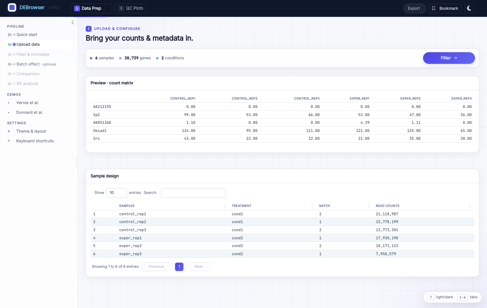
```

## Low-count filtering & normalization

The **Filter & normalize** step trims features with little or no signal before
modelling. Pick a filtering method — **Max**, **Mean**, or **CPM** — and a
cutoff; DEBrowser shows the row count *before* and *after* filtering side by
side, plus per-sample count histograms, so you can see the effect immediately.

```{r filter, echo=FALSE, eval=TRUE, fig.cap="Low-count filtering: choose Max/Mean/CPM and a threshold. Here the Vernia demo drops from 30,739 to 14,022 features."}
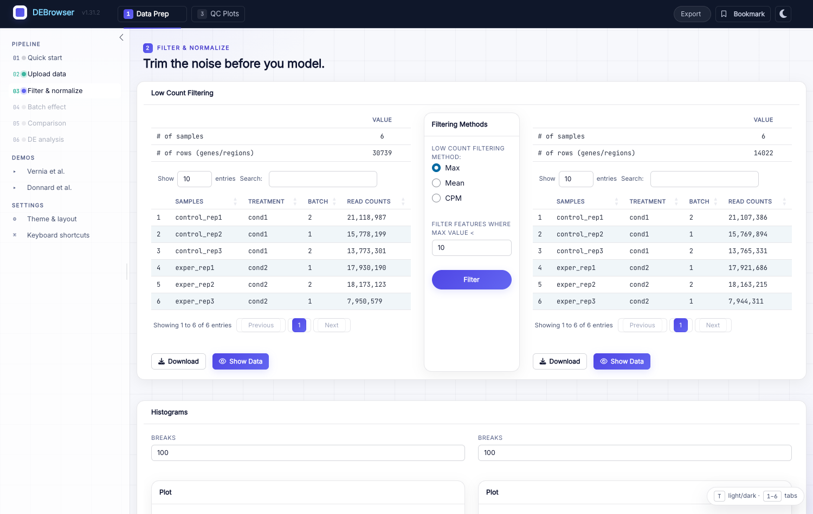
```

## Batch-effect correction

The **Batch effect** step (optional) lets you correct for technical
confounders. Choose a **normalization method** (MRN, TMM, RLE,
upperquartile, or none) and a **correction method** (ComBat, ComBat-Seq, or
Harman), then **Submit**. Inline QC plots — **PCA**, **IQR**, and **Density**,
each with a *Before* / *After* view — let you confirm that samples cluster by
biology rather than by batch after correction.

```{r batch, echo=FALSE, eval=TRUE, fig.cap="Batch-effect correction and normalization, with inline PCA / IQR / Density QC plots below the options."}
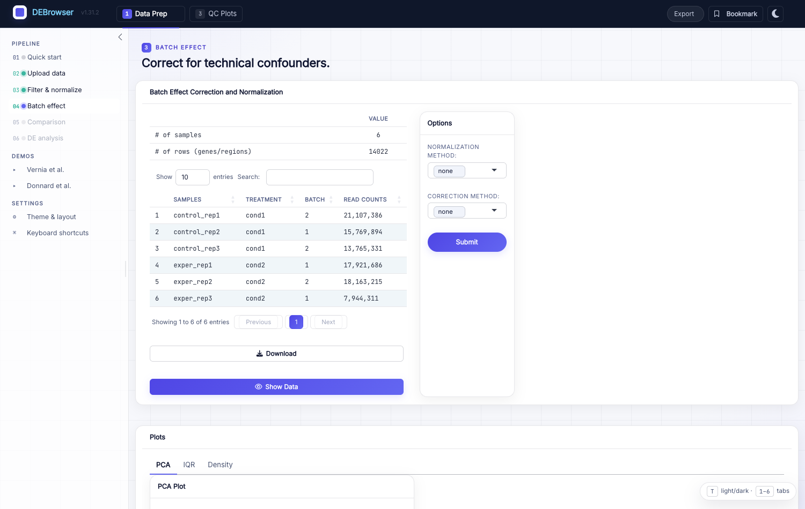
```

## Choosing comparisons

The **Comparison** step is where you define which groups to test. DEBrowser
auto-populates a first comparison from your conditions; use **Add comparison**
to set up several contrasts at once (each becomes its own DE result set you can
switch between later). Assign samples to the *Treatment* and *Control* side of
each comparison, then pick the DE engine and its parameters.

```{r comparison, echo=FALSE, eval=TRUE, fig.cap="Comparison selection: assign samples to each side of one or more contrasts before running DE."}
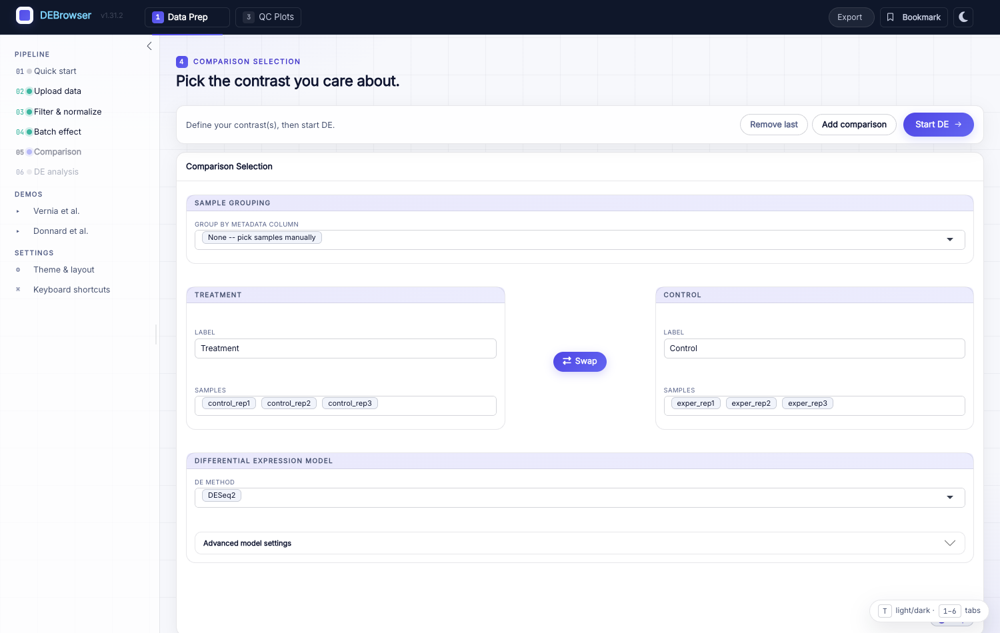
```

## Running DE analysis

Clicking **Start DE** runs the analysis. DEBrowser reports progress in stages
(Normalizing → Fitting → Contrasts) and, when finished, unlocks the result
tabs and jumps to **Main Plots**.

# Differential expression engines

DEBrowser exposes the parameters that matter for each engine directly in the
Comparison step.

## DESeq2

DESeq2 (see the
[user guide](https://bioconductor.org/packages/DESeq2)) groups samples into
conditions and computes, for every gene, the probability of differential
expression using a negative binomial model, reporting both nominal and
multiple-testing-corrected (`padj`) p-values.

- **fitType** — `parametric`, `local`, or `mean`: how dispersions are fit to
  the mean intensity.
- **betaPrior** — whether to place a zero-mean normal prior on the
  non-intercept coefficients.
- **testType** — `Wald` (nbinomWaldTest) or `LRT` (likelihood-ratio test on
  the difference in deviance between full and reduced models).
- **rowsum.filter** — features with total count (across all samples) below
  this value are filtered out.

DESeq2 needs raw, un-normalized integer counts; DEBrowser converts non-integer
values as needed.

## edgeR

See the
[edgeR user guide](https://bioconductor.org/packages/edgeR).

- **Normalization** — scaling factors for raw library sizes: `TMM`, `RLE`,
  `upperquartile`, or `none`.
- **Dispersion** — a numeric dispersion or a string telling edgeR to estimate
  it from the data.
- **testType** — `exactTest` (per-gene exact test between two groups) or
  `glmLRT` (negative-binomial GLM with genewise likelihood-ratio tests).
- **rowsum.filter** — low-total-count features are removed.

## limma

See the
[limma user guide](https://bioconductor.org/packages/limma). limma is ideal
when data are already normalized (e.g. spike-in or another scaling), in which
case prefer it over DESeq2 or edgeR.

- **Normalization** — `TMM`, `RLE`, `upperquartile`, or `none`.
- **Fit Type** — `ls` (least squares) or `robust` (robust regression).
- **Norm. Bet. Arrays** — normalize between arrays so intensities/log-ratios
  share similar distributions across samples.
- **rowsum.filter** — low-total-count features are removed.

# Main Plots

The **Main Plots** tab is DEBrowser's interactive heart. Choose **Scatter**,
**Volcano Plot**, or **MA Plot** from the left rail; genes are colored **Up**
(red), **Down** (blue), or **NS** (grey) according to your `padj` and
log2-fold-change cutoffs. Adjust a cutoff and every plot and table updates
instantly.

```{r main, echo=FALSE, eval=TRUE, fig.cap="Main Plots — a scatter of normalized means, with Up/Down/NS genes. Volcano and MA views share the same interactive controls."}
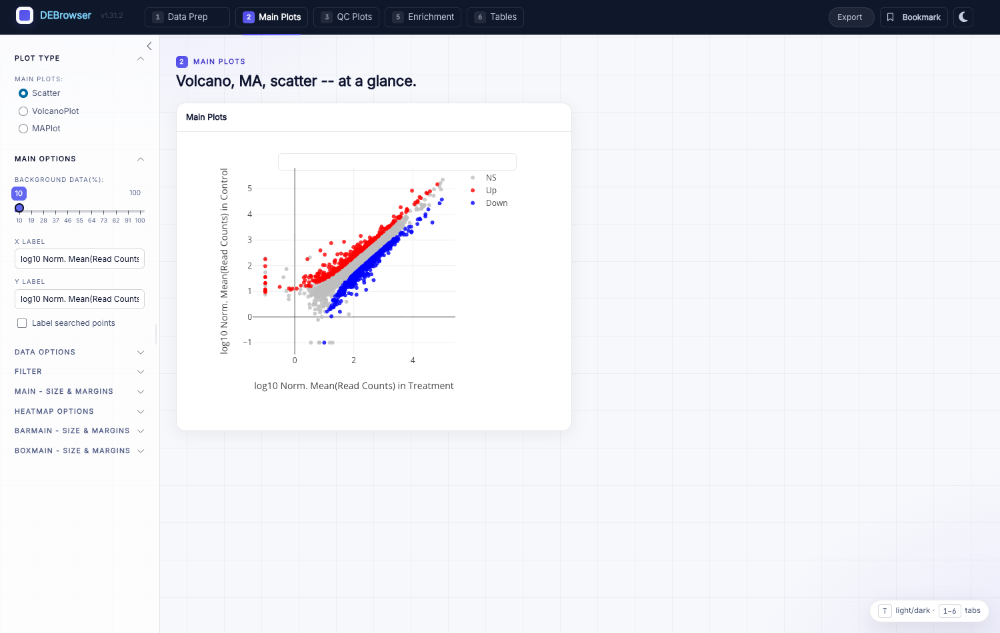
```

```{r volcano, echo=FALSE, eval=TRUE, fig.cap="The Volcano view of the same result: log2 fold change vs. -log10 adjusted p-value."}
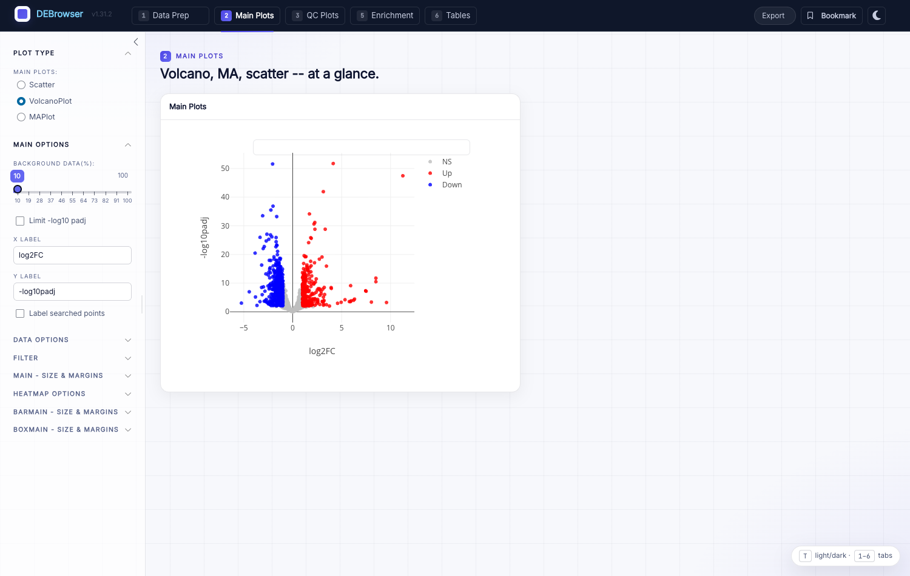
```

Left-rail controls let you set the background-data percentage, axis labels,
data and filter options, plot sizing/margins, and heatmap options.

## Linked heatmap of a selection

Select a region of a Main Plot with the **box-select** or **lasso-select**
tool and a heatmap of just those genes appears alongside. Click a group label
(Up / Down / NS) in the legend to hide it, so you can lasso only up- or
down-regulated genes. The selection also feeds the Enrichment tab.

> Normalize before plotting heatmaps: **Data options → Normalization Methods**.

### Clustering & linkage methods

Available linkage methods for the heatmap:

- **complete** — closest cluster pairs merged up to a distance threshold;
  distance between clusters is the maximum pairwise member distance.
- **ward.D2** — minimizes within-cluster squared deviations for compact,
  spherical clusters (dissimilarities squared before updating; sensitive to
  outliers).
- **single** — minimum of pairwise member distances.
- **average** — average of pairwise member distances.
- **mcquitty** — new cluster distance is the average of the merged clusters'
  distances to each other cluster.
- **median** — averaging using the median to reduce outlier influence.
- **centroid** — Euclidean distance between cluster centroids/means.

### Distance methods

- **cor** — `1 - cor(x)`; robust to outliers and scaling.
- **euclidean** — root sum of squared differences; sensitive to
  outliers/scaling.
- **maximum** — maximum distance across corresponding genes.
- **manhattan** — sum of absolute differences.
- **canberra** — a scaled Minkowski variant dividing absolute differences by
  the sum of absolute counts.
- **minkowski** — generalized Euclidean distance.

## Interactive heatmap & scale options

Tick **Interactive** (left panel, under height/width) to switch to a
zoomable two-color heatmap — click and drag to select genes for Enrichment
queries. Because interactive rendering is heavier, it is off by default; enable
it once you've settled on clustering parameters.

The **Scale Option** panel controls:

1. **Center** — subtract column means (default: on).
2. **Scale** — divide (centered) columns by their standard deviation, or the
   root-mean-square if centering is off (default: on).
3. **Log** — apply `log2` to the matrix (default: on).
4. **Pseudo-Count** — a small value added before `log2` to avoid `log(0)`
   (default: 0.1).

# Quality-control plots

The **QC Plots** tab summarizes the whole dataset independent of any single
comparison. It offers **all-to-all** sample scatter (pairwise correlation),
**PCA**, **IQR**, and **density** views, each computed on your chosen
normalization. The same PCA / IQR / Density views also appear inline on the
Batch effect step so you can judge correction *before* running DE. Use these to
spot outlier samples, mislabeled conditions, or residual batch structure.

# Cross-contrast concordance

When you define **two or more comparisons**, the **Concordance** tab shows
where the contrasts agree and disagree — for example, which genes move the same
way in two knockouts versus a shared control. This makes it easy to separate
condition-specific effects from shared ones without exporting to another tool.

# Enrichment: GO, KEGG & GSEA

The **Enrichment** tab turns a gene list — all detected, a
Main-Plot/heatmap selection, or a comparison's up/down set — into pathway-level
biology.

- **Over-representation** (clusterProfiler): `enrichGO`, `enrichKEGG`,
  `Disease`, and `compareCluster`, each producing summary and dot plots. Pick
  the ontology, `padj`, and fold-change cutoffs on the left, then **Submit**.
- **GSEA** (fgsea): rank-based gene-set enrichment against MSigDB collections,
  with a leading-edge view and a normalized-enrichment-score (NES) heatmap
  across comparisons.

Changing the ontology exposes ontology-specific parameters at the bottom of the
option panel.

# Data tables

The **Tables** tab renders your results as searchable, sortable tables. Choose
a dataset from the left panel:

- All Detected · Up Regulated · Down Regulated · Up+Down Regulated ·
  Selected scatterplot points · Most varied genes · Comparison differences

Each table (except *Comparisons*) includes: gene **ID**, per-sample normalized
counts, condition averages, **padj**, **log2FoldChange**, **foldChange**, and
**log10padj**. The *Comparisons* table adds, for each pairwise contrast, the
per-sample values plus foldChange, p-value, and padj.

Every table has a search box (top-right); the left-panel search accepts
comma-separated lists and regex (e.g. `^al`, `*lm`) and applies everywhere in
DEBrowser — plots and tables alike. Return to **Data Prep** at any time to add
comparisons or change parameters and resubmit.

# Bookmarking & sharing

The **Bookmark** button (top-right) captures the *entire* analysis state —
loaded data, filters, comparisons, cutoffs, and the active view — behind a
stable URL. Because `startDEBrowser()` pins the port, the link keeps working
across restarts, so you can share a specific figure or hand an analysis to a
collaborator exactly as you left it.

```{r bookmark, echo=FALSE, eval=TRUE, fig.cap="The Bookmark / share dialog captures the full analysis state behind a stable, shareable URL."}
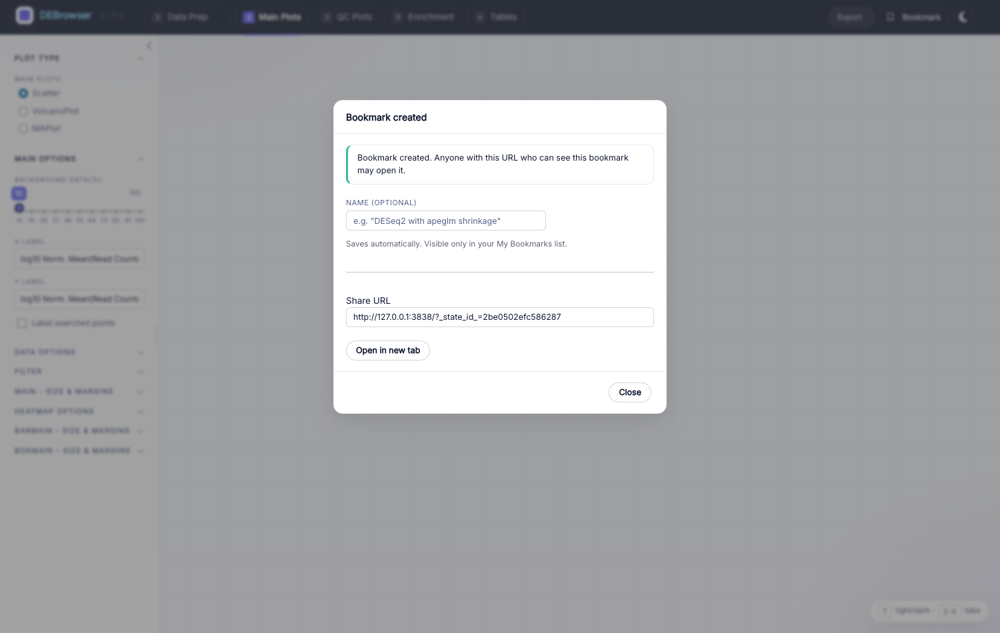
```

# Reproducibility & export

The **Export** menu (top-right) turns your interactive session into reusable
artifacts:

- **R script** — the analysis as runnable R.
- **R Markdown** — a full report source, plus a rendered **HTML** you can view
  in a new tab.
- **Jupyter notebook** — the analysis as an `.ipynb`.
- **Methods paragraph** — a copy-ready methods description (engines, versions,
  parameters) for a manuscript.

Together with bookmarking, these make a DEBrowser analysis reproducible rather
than a one-off click-through.

# AI interpretation (optional)

DEBrowser includes an optional AI assistant that summarizes the biology of a
gene set alongside a selected GSEA pathway on the Enrichment tab. It is
**off by default** — no network calls happen until you explicitly enable it and
configure a provider.

```{r ai, echo=FALSE, eval=TRUE, fig.cap="The AI Settings dialog: enable AI features, choose a provider and model, and pick a default privacy mode."}
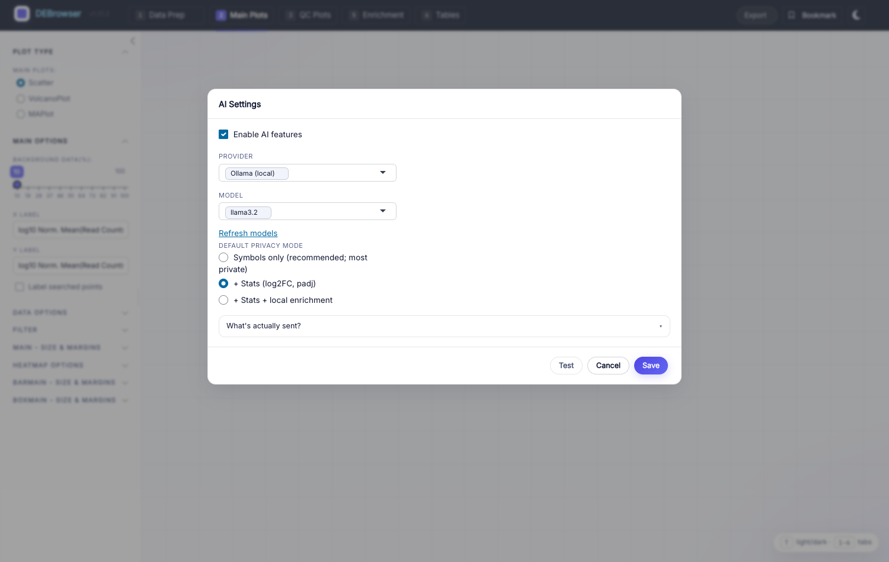
```

## Enabling AI features

1. Open **AI Assistant** (the settings entry in the navbar). A dialog opens.
2. Tick **Enable AI features**.
3. Pick a **Provider**:
   - **Anthropic** (Claude) — API key from console.anthropic.com.
   - **OpenAI** (GPT) — API key from platform.openai.com.
   - **Ollama** (local LLM, no key) — runs entirely on your machine; the
     privacy-preserving option, since no data leaves your computer.
4. Choose a **Model** (auto-populated from your provider; use *Refresh
   models* to re-fetch).
5. For Anthropic/OpenAI, paste your API key — stored encrypted in your OS
   keychain via `keyring`, never in plaintext on disk.
6. Pick a **default privacy mode** (recommended: *Symbols only*).
7. Click **Test** for a one-token round-trip, then **Save**.

After saving, an AI interpretation card appears below the *Leading edge* card
on the Enrichment tab whenever a GSEA pathway is selected. Pick a question,
adjust privacy and Top-N, preview the exact prompt with **What will be sent?**,
then click **Ask AI**.

## Privacy modes

Three per-call modes control what leaves your machine:

- **Symbols only** (default; most private) — just the leading-edge gene
  symbols.
- **+ Stats** — also `log2FoldChange` and adjusted p-value per gene.
- **+ Stats + Enrichment** — also the term name, fgsea p-value, and overlap
  count.

Responses render as plain preformatted text — no markdown parsing, no HTML
execution, no automatic link traversal — as a defense against
untrusted-content patterns in model output.

## Installing the AI packages

The AI features depend on three `Suggests` packages:

```{r ai-pkgs}
install.packages(c("ellmer", "whisker", "keyring"))
```

If any are missing, AI stays unavailable and DEBrowser shows a clear
"Install the X package…" notice; the rest of the app is unaffected. `R CMD
check` and `BiocCheck` both pass without any AI package installed — the feature
is strictly additive.

## Installing Ollama (local provider)

Ollama runs the model on your own machine — no API key, no data sent out.

**macOS (install standalone, not Docker).** On Apple Silicon the standalone
build uses the Metal GPU with unified memory and is far faster; Docker runs
Ollama in a Linux VM that can't reach the Apple GPU (5–10× slower on CPU).

```sh
brew install ollama          # or the .dmg from https://ollama.com/download
ollama serve &               # the menu-bar app also starts this
ollama pull llama3.2         # ~2 GB, one-time
```

**Linux.**

```sh
curl -fsSL https://ollama.com/install.sh | sh
ollama pull llama3.2
```

**Verify** the API (default `http://localhost:11434`):

```sh
curl http://localhost:11434/api/tags
```

Settings → AI → Provider: Ollama → **Test** runs this check and surfaces a
"Could not reach Ollama" hint if the service is down.

## Why AI is off by default

DEBrowser is used in biomedical settings where sharing patient-derived gene
names with a third-party LLM may be unacceptable. The master switch keeps the
feature inert until you explicitly opt in and choose a provider — and the local
Ollama option keeps everything on your machine.

# Theming & keyboard shortcuts

- Toggle **light / dark** with the moon/sun button or the `T` key.
- Jump between the six top-level tabs with the number keys **`1`–`6`**.
- Shortcuts are ignored while you're typing in a field.

# Case study

Using the Vernia et al. (2014) dataset — the "advanced demo" — you can
reproduce the paper's findings interactively. The study's heatmaps used k-means
(k = 6) clustering; DEBrowser reproduces closely comparable views over the same
data.

**JNK2 vs. JNK1 knockout.** Comparing high-fat-diet JNK1-KO and JNK2-KO against
HFD wild type shows a stronger effect from JNK2 KO: 177 genes at
`padj < 0.01` and `|log2FC| > 1` in the JNK2 comparison, versus only 17 in the
JNK1 comparison.

**Partially redundant functions.** The HFD JNK1/JNK2 double KO has 1018
significantly changed genes. Comparing single KOs side by side, most up/down
genes do not overlap — only 1 of the 17 JNK1-KO genes is shared — suggesting
individual as well as redundant roles. In KEGG, JNK1-KO genes enrich for
"fatty acid elongation" while JNK2-KO genes enrich for "PPAR signaling" and
"biosynthesis of unsaturated fatty acids". DEBrowser's comparison and
enrichment tools make this side-by-side analysis straightforward.

Browsing, adjusting parameters, and building plots interactively makes
DEBrowser a fast way to check the reproducibility of published results.

# Operating system dependencies

On Fedora/Red Hat/CentOS:

```sh
openssl-devel libxml2-devel libcurl-devel libpng-devel
```

On Ubuntu:

```sh
sudo apt-get install libcurl4-openssl-dev libssl-dev \
  libxml2-dev libudunits2-dev
```

# Autoloading data via URL

DEBrowser can load a dataset from a JSON descriptor passed in the URL:

```
https://debrowser.umassmed.edu/?jsonobject=<count-json-url>
```

Add metadata with a second parameter:

```
https://debrowser.umassmed.edu/?jsonobject=<count-json-url>&meta=<meta-json-url>
```

Opening such a URL loads the referenced data automatically.

# Session information

```{r session, echo=FALSE, eval=TRUE}
sessionInfo()
```

# References

1. Anders S. et al. (2014) HTSeq — A Python framework to work with
   high-throughput sequencing data.
2. Chang W. et al. (2016) shiny: Web Application Framework for R.
3. Giardine B. et al. (2005) Galaxy: a platform for interactive large-scale
   genome analysis. *Genome Res.* 15, 1451–1455.
4. Johnson W.E. et al. (2007) Adjusting batch effects in microarray expression
   data using empirical Bayes methods. *Biostatistics* 8, 118–127.
5. Love M.I. et al. (2014) Moderated estimation of fold change and dispersion
   for RNA-seq data with DESeq2. *Genome Biol.* 15, 550.
6. Murtagh F. and Legendre P. (2014) Ward's hierarchical agglomerative
   clustering method. *J. Classification* 31.
7. Ritchie M.E. et al. (2015) limma powers differential expression analyses for
   RNA-sequencing and microarray studies. *Nucleic Acids Res.* 43, e47.
8. Robinson M.D. et al. (2010) edgeR: a Bioconductor package for differential
   expression analysis of digital gene expression data. *Bioinformatics* 26,
   139–140.
9. Vernia S. et al. (2014) The PPARα-FGF21 hormone axis contributes to
   metabolic regulation by the hepatic JNK signaling pathway. *Cell Metab.* 20,
   512–525.
